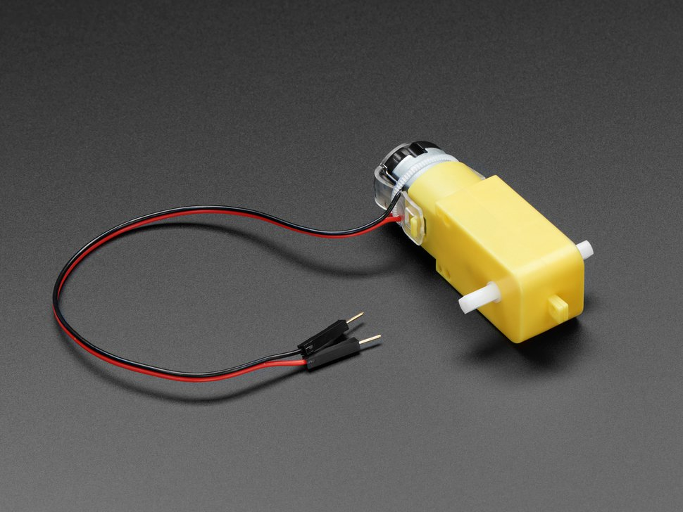
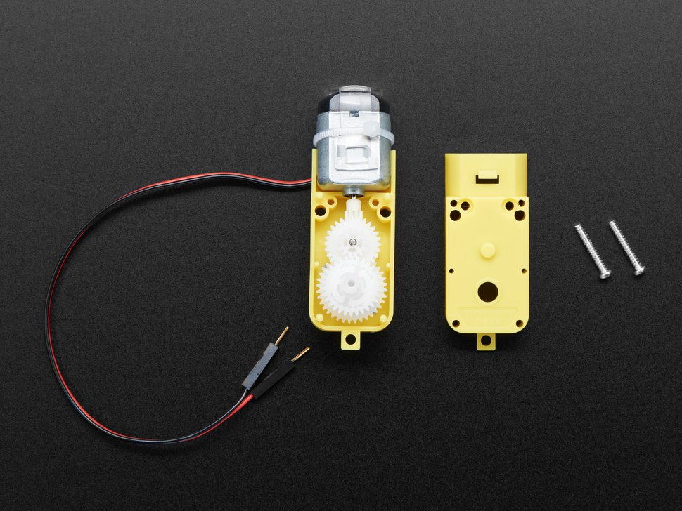
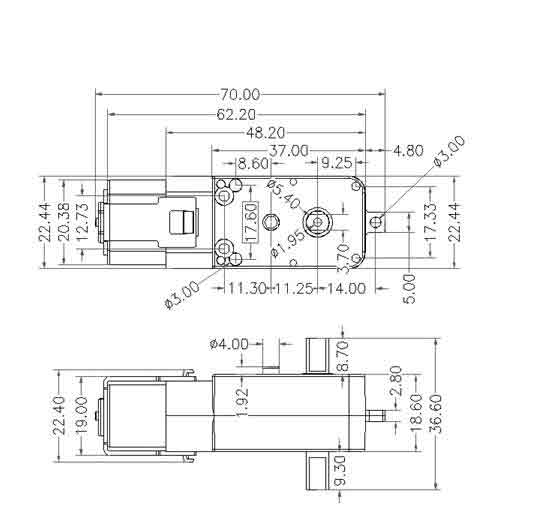

# DC Gearbox Motor - "TT Motor" - 200RPM - 3 to 6VDC

## Source.

[AdaFruit.](https://www.adafruit.com/product/3777)

## Photos.

### Overview.

### Open.

## Technical Details.

* Rated Voltage: 3~6V
* Continuous No-Load Current: 150mA +/- 10%
* Min. Operating Speed (3V): 90+/- 10% RPM
* Min. Operating Speed (6V): 200+/- 10% RPM
* Torque: 0.15Nm ~0.60Nm
* Stall Torque (6V): 0.8kg.cm
* Gear Ratio: 1:48
* Body Dimensions: 70 x 22 x 18mm
* Wires Length: 200mm & 28 AWG
* Weight: 30.6g

## Drawing.

